# Loading the Dataset

Let's first load data and see whats inside.


```python
import math
import pandas as pd
import numpy as np
import matplotlib
import matplotlib.pyplot as plt
from matplotlib import gridspec
import seaborn as sns
%matplotlib inline
matplotlib.rc("savefig", dpi=100)


data = pd.read_csv('titanic-data.csv')
data.head()
```


<div>
<style>
    .dataframe thead tr:only-child th {
        text-align: right;
    }

    .dataframe thead th {
        text-align: left;
    }

    .dataframe tbody tr th {
        vertical-align: top;
    }
</style>
<table border="1" class="dataframe">
  <thead>
    <tr style="text-align: right;">
      <th></th>
      <th>PassengerId</th>
      <th>Survived</th>
      <th>Pclass</th>
      <th>Name</th>
      <th>Sex</th>
      <th>Age</th>
      <th>SibSp</th>
      <th>Parch</th>
      <th>Ticket</th>
      <th>Fare</th>
      <th>Cabin</th>
      <th>Embarked</th>
    </tr>
  </thead>
  <tbody>
    <tr>
      <th>0</th>
      <td>1</td>
      <td>0</td>
      <td>3</td>
      <td>Braund, Mr. Owen Harris</td>
      <td>male</td>
      <td>22.0</td>
      <td>1</td>
      <td>0</td>
      <td>A/5 21171</td>
      <td>7.2500</td>
      <td>NaN</td>
      <td>S</td>
    </tr>
    <tr>
      <th>1</th>
      <td>2</td>
      <td>1</td>
      <td>1</td>
      <td>Cumings, Mrs. John Bradley (Florence Briggs Th...</td>
      <td>female</td>
      <td>38.0</td>
      <td>1</td>
      <td>0</td>
      <td>PC 17599</td>
      <td>71.2833</td>
      <td>C85</td>
      <td>C</td>
    </tr>
    <tr>
      <th>2</th>
      <td>3</td>
      <td>1</td>
      <td>3</td>
      <td>Heikkinen, Miss. Laina</td>
      <td>female</td>
      <td>26.0</td>
      <td>0</td>
      <td>0</td>
      <td>STON/O2. 3101282</td>
      <td>7.9250</td>
      <td>NaN</td>
      <td>S</td>
    </tr>
    <tr>
      <th>3</th>
      <td>4</td>
      <td>1</td>
      <td>1</td>
      <td>Futrelle, Mrs. Jacques Heath (Lily May Peel)</td>
      <td>female</td>
      <td>35.0</td>
      <td>1</td>
      <td>0</td>
      <td>113803</td>
      <td>53.1000</td>
      <td>C123</td>
      <td>S</td>
    </tr>
    <tr>
      <th>4</th>
      <td>5</td>
      <td>0</td>
      <td>3</td>
      <td>Allen, Mr. William Henry</td>
      <td>male</td>
      <td>35.0</td>
      <td>0</td>
      <td>0</td>
      <td>373450</td>
      <td>8.0500</td>
      <td>NaN</td>
      <td>S</td>
    </tr>
  </tbody>
</table>
</div>


Here is data description on [Kaggle](https://www.kaggle.com/c/titanic/data):

## Data Dictionary

### Variable	Definition	Key

**survival**	Survival	0 = No, 1 = Yes	
**pclass**	Ticket class	1 = 1st, 2 = 2nd, 3 = 3rd	
**sex**	Sex	
**Age**	Age in years	
**sibsp**	# of siblings / spouses aboard the Titanic	
**parch**	# of parents / children aboard the Titanic	
**ticket**	Ticket number	
**fare**	Passenger fare	
**cabin**	Cabin number	
**embarked**	Port of Embarkation	C = Cherbourg, Q = Queenstown, S = Southampton

## Variable Notes

**pclass:** A proxy for socio-economic status (SES)
1st = Upper
2nd = Middle
3rd = Lower

**age**: Age is fractional if less than 1. If the age is estimated, is it in the form of xx.5

**sibsp**: The dataset defines family relations in this way...
*Sibling* = brother, sister, stepbrother, stepsister
*Spouse* = husband, wife (mistresses and fiancés were ignored)

**parch**: The dataset defines family relations in this way...
*Parent* = mother, father
*Child* = daughter, son, stepdaughter, stepson
Some children travelled only with a nanny, therefore parch=0 for them.

# Introduction

** So, lets think about what we can investigate with this data.**

* We can see the distribution of passenger for
    * each passenger class,
    * gender,
    * age,
    * etc
* We can measure correlation between survival and other important variables. What first come to mind could be following:
    * Passenger class (obviously)
    * Passenger age
    * Passenger having parents aboard. (This seems tricky. We probably need to compare them to the same age passengers with no parents and we should also eliminate other variables proved to be correlated such as passenger class etc.)
    * Fare paid. We should also check if there is strong correlation between Fare waged and passenger class. 
    
    

## Questions to be Answered

* **Which groups of people have the highest rates of survival?**
* **What parameters have the highest influence on survival?**
* **Does the narrative in Titanic (1997) movie fit our expectations about Rose and Jack?**

To answer quetions above I am planning to,

1. acquire basic stats for dataset,
2. check for any problems within data,
3. clean data and fix problems,
4. investigate questions,

and finally discuss the results.

# Descriptive Statistics for the Dataset


```python
data.describe()
```


<div>
<style>
    .dataframe thead tr:only-child th {
        text-align: right;
    }

    .dataframe thead th {
        text-align: left;
    }

    .dataframe tbody tr th {
        vertical-align: top;
    }
</style>
<table border="1" class="dataframe">
  <thead>
    <tr style="text-align: right;">
      <th></th>
      <th>PassengerId</th>
      <th>Survived</th>
      <th>Pclass</th>
      <th>Age</th>
      <th>SibSp</th>
      <th>Parch</th>
      <th>Fare</th>
    </tr>
  </thead>
  <tbody>
    <tr>
      <th>count</th>
      <td>891.000000</td>
      <td>891.000000</td>
      <td>891.000000</td>
      <td>714.000000</td>
      <td>891.000000</td>
      <td>891.000000</td>
      <td>891.000000</td>
    </tr>
    <tr>
      <th>mean</th>
      <td>446.000000</td>
      <td>0.383838</td>
      <td>2.308642</td>
      <td>29.699118</td>
      <td>0.523008</td>
      <td>0.381594</td>
      <td>32.204208</td>
    </tr>
    <tr>
      <th>std</th>
      <td>257.353842</td>
      <td>0.486592</td>
      <td>0.836071</td>
      <td>14.526497</td>
      <td>1.102743</td>
      <td>0.806057</td>
      <td>49.693429</td>
    </tr>
    <tr>
      <th>min</th>
      <td>1.000000</td>
      <td>0.000000</td>
      <td>1.000000</td>
      <td>0.420000</td>
      <td>0.000000</td>
      <td>0.000000</td>
      <td>0.000000</td>
    </tr>
    <tr>
      <th>25%</th>
      <td>223.500000</td>
      <td>0.000000</td>
      <td>2.000000</td>
      <td>20.125000</td>
      <td>0.000000</td>
      <td>0.000000</td>
      <td>7.910400</td>
    </tr>
    <tr>
      <th>50%</th>
      <td>446.000000</td>
      <td>0.000000</td>
      <td>3.000000</td>
      <td>28.000000</td>
      <td>0.000000</td>
      <td>0.000000</td>
      <td>14.454200</td>
    </tr>
    <tr>
      <th>75%</th>
      <td>668.500000</td>
      <td>1.000000</td>
      <td>3.000000</td>
      <td>38.000000</td>
      <td>1.000000</td>
      <td>0.000000</td>
      <td>31.000000</td>
    </tr>
    <tr>
      <th>max</th>
      <td>891.000000</td>
      <td>1.000000</td>
      <td>3.000000</td>
      <td>80.000000</td>
      <td>8.000000</td>
      <td>6.000000</td>
      <td>512.329200</td>
    </tr>
  </tbody>
</table>
</div>


**Things we can deduct from above stats:**
* There seems to be 891 passengers aboard. A quick check on Google shows that there are actually around [1316](https://en.wikipedia.org/wiki/Sinking_of_the_RMS_Titanic#Casualties_and_survivors) passengers. Therefore, this dataset has to be a subset of all passengers.
* 38.4% of pasengers survived. (mean of survived is 0.384)
* For those have their age submitted age average is 29.7.
* Average fare paid for tickets is 32. We don't know currency though. Total ticket fare stands at 32 * 891 = 28.7k.


# Checking for Promlems in Data

Let's first check for number of missing values in each column.


```python
pd.DataFrame(data.isnull().sum()).transpose()
```


<div>
<style>
    .dataframe thead tr:only-child th {
        text-align: right;
    }

    .dataframe thead th {
        text-align: left;
    }

    .dataframe tbody tr th {
        vertical-align: top;
    }
</style>
<table border="1" class="dataframe">
  <thead>
    <tr style="text-align: right;">
      <th></th>
      <th>PassengerId</th>
      <th>Survived</th>
      <th>Pclass</th>
      <th>Name</th>
      <th>Sex</th>
      <th>Age</th>
      <th>SibSp</th>
      <th>Parch</th>
      <th>Ticket</th>
      <th>Fare</th>
      <th>Cabin</th>
      <th>Embarked</th>
    </tr>
  </thead>
  <tbody>
    <tr>
      <th>0</th>
      <td>0</td>
      <td>0</td>
      <td>0</td>
      <td>0</td>
      <td>0</td>
      <td>177</td>
      <td>0</td>
      <td>0</td>
      <td>0</td>
      <td>0</td>
      <td>687</td>
      <td>2</td>
    </tr>
  </tbody>
</table>
</div>


We already know about missing entries in Cabin and Age columns, but missing values in Embarked seems suspicious.


```python
data[data["Embarked"].isnull()]
```


<div>
<style>
    .dataframe thead tr:only-child th {
        text-align: right;
    }

    .dataframe thead th {
        text-align: left;
    }

    .dataframe tbody tr th {
        vertical-align: top;
    }
</style>
<table border="1" class="dataframe">
  <thead>
    <tr style="text-align: right;">
      <th></th>
      <th>PassengerId</th>
      <th>Survived</th>
      <th>Pclass</th>
      <th>Name</th>
      <th>Sex</th>
      <th>Age</th>
      <th>SibSp</th>
      <th>Parch</th>
      <th>Ticket</th>
      <th>Fare</th>
      <th>Cabin</th>
      <th>Embarked</th>
    </tr>
  </thead>
  <tbody>
    <tr>
      <th>61</th>
      <td>62</td>
      <td>1</td>
      <td>1</td>
      <td>Icard, Miss. Amelie</td>
      <td>female</td>
      <td>38.0</td>
      <td>0</td>
      <td>0</td>
      <td>113572</td>
      <td>80.0</td>
      <td>B28</td>
      <td>NaN</td>
    </tr>
    <tr>
      <th>829</th>
      <td>830</td>
      <td>1</td>
      <td>1</td>
      <td>Stone, Mrs. George Nelson (Martha Evelyn)</td>
      <td>female</td>
      <td>62.0</td>
      <td>0</td>
      <td>0</td>
      <td>113572</td>
      <td>80.0</td>
      <td>B28</td>
      <td>NaN</td>
    </tr>
  </tbody>
</table>
</div>


It seems these two ladies somehow dodged reporting their Embarking port. First I thought they might have never boarded, however a quick Google search([1](https://www.encyclopedia-titanica.org/titanic-survivor/martha-evelyn-stone.html), [2](https://www.encyclopedia-titanica.org/titanic-survivor/amelia-icard.html)) proved me wrong. 

These two ladies boarded at **Southampton** port. So I will fix data accordingly. 

** Apart from above problem, there are also other problems with data that we should take care of when working with it:**

* Not all passengers have a cabin class.
* Not all passengers have age reported.

**Cabin Data**

Further looking into missing variables on internet, I can deduce from discussion [here](https://www.encyclopedia-titanica.org/cabins.html) and [here](https://www.kaggle.com/c/titanic/discussion/4693) that cabin variable is not to be taken seriously in terms of deciding effects on survival. As a matter of fact, cabin data seems to be mostly collected from survivors which adds a significant bias to the vairable. So We can simply ignore this variable and remove missing entries while calculating correlation between Cabin and survival.

*For the time being I decided not to exclude entries with missing values from start, since these entries can contribute to other calculations. In fact, even lack of these values could provide some insight into data. Though, I will still work with filtered data without these entries, when needed* 

## Data Cleaning

To better visualize data and infer better results from charts I will make following corrections: 

* Create another column for pClass in descending order which will give positive correlation with Survival instead of negative. (I don't like referring negative correlations when both variable sound like being positive.)
* Create another column for enumerated genders to calculate survival correlation. (0:male, 1: female)
* Create another column for enumerated Port number to calculate survival correlation. (0: Cherbourg, 1: Queenstown, 2: Southampton)
* Create another column for Fare into discreate bins(binsize=10) to make better plots.
* Create another column for Age into age groups accepted by [World Health Organization](http://www.who.int/healthinfo/survey/ageingdefnolder/en/): 
    * child - 0 to 9 years 
    * Teen - 10-19 years,
    * young - 15 to 24 years
        * Young and teen overlap, so I will be setting demarcation at 17. (10-17:teen, 18-24 young) 
    * adult - 25 to 59 years
    * elderly - 60+
* Set NaN values in Cabin column to "No Cabin"
* Create another column for Cabin for whether passenger have a cabin or not. (0:no cabin, 1: has a cabin)

**Note:** Even though there are NaN values in Cabin column, I will simply replace those with "No Cabin" and won't remove these lines.


```python
def replace_cabin(cabin):
    if cabin == "No Cabin":
        return 0
    else:
        return 1

def replace_port(port):
    if port == 'C':
        return 0
    elif port == 'Q':
        return 1
    elif port == 'S':
        return 2
    else: 
        # Missing two values will fall in this code block. Both embarked on Southampton, so we should return 2
        return 2

def age_reported(age):
    if age<0:
        return 0
    else:
        return 1

def group_ages(age):
    if age<10:
        return 0
    elif age<18:
        return 1
    elif age<25:
        return 2
    elif age<60:
        return 3
    else:
        return 4

# define enumerations:
genders = ["male","female"]
classes = ["1st class", "2nd class", "3rd class"]
age_groups = ["child","teen","young","adult","elderly"]
ports = ["Cherbourg", "Queenstown", "Southampton"]

# Fix two passengers missing from Embarked column
data["Embarked"].loc[data["Embarked"].isnull()].loc[:] = 'S'
# Create new columns
data["Sex_"] = data["Sex"].copy().map({'female': 1, 'male': 0})
data["Pclass_"] = data["Pclass"].copy().map({1: 2, 2: 1,3:0})
data["Fare_"] = data["Fare"].copy().apply(lambda x: math.floor(x/10)*10)
data["Age_"] = data["Age"].copy().apply(lambda x: math.floor(x/5)*5)
data["AgeGroups"] = data["Age"].copy().apply(group_ages)
data["AgeReported"] = data["Age"].copy().fillna(value=-1).apply(age_reported)
#data["Cabin"].loc[data["Cabin"].isnull()].loc[:] = "No Cabin"
data["Cabin"] = data["Cabin"].fillna(value="No Cabin")
data["Cabin_"] = data["Cabin"].copy().apply(replace_cabin)

data["Embarked_"] = data["Embarked"].copy().apply(replace_port)

data_non_na = data.dropna(axis=0, how='any')
data_non_na.head()
```


<div>
<style>
    .dataframe thead tr:only-child th {
        text-align: right;
    }

    .dataframe thead th {
        text-align: left;
    }

    .dataframe tbody tr th {
        vertical-align: top;
    }
</style>
<table border="1" class="dataframe">
  <thead>
    <tr style="text-align: right;">
      <th></th>
      <th>PassengerId</th>
      <th>Survived</th>
      <th>Pclass</th>
      <th>Name</th>
      <th>Sex</th>
      <th>Age</th>
      <th>SibSp</th>
      <th>Parch</th>
      <th>Ticket</th>
      <th>Fare</th>
      <th>Cabin</th>
      <th>Embarked</th>
      <th>Sex_</th>
      <th>Pclass_</th>
      <th>Fare_</th>
      <th>Age_</th>
      <th>AgeGroups</th>
      <th>AgeReported</th>
      <th>Cabin_</th>
      <th>Embarked_</th>
    </tr>
  </thead>
  <tbody>
    <tr>
      <th>0</th>
      <td>1</td>
      <td>0</td>
      <td>3</td>
      <td>Braund, Mr. Owen Harris</td>
      <td>male</td>
      <td>22.0</td>
      <td>1</td>
      <td>0</td>
      <td>A/5 21171</td>
      <td>7.2500</td>
      <td>No Cabin</td>
      <td>S</td>
      <td>0</td>
      <td>0</td>
      <td>0.0</td>
      <td>20.0</td>
      <td>2</td>
      <td>1</td>
      <td>0</td>
      <td>2</td>
    </tr>
    <tr>
      <th>1</th>
      <td>2</td>
      <td>1</td>
      <td>1</td>
      <td>Cumings, Mrs. John Bradley (Florence Briggs Th...</td>
      <td>female</td>
      <td>38.0</td>
      <td>1</td>
      <td>0</td>
      <td>PC 17599</td>
      <td>71.2833</td>
      <td>C85</td>
      <td>C</td>
      <td>1</td>
      <td>2</td>
      <td>70.0</td>
      <td>35.0</td>
      <td>3</td>
      <td>1</td>
      <td>1</td>
      <td>0</td>
    </tr>
    <tr>
      <th>2</th>
      <td>3</td>
      <td>1</td>
      <td>3</td>
      <td>Heikkinen, Miss. Laina</td>
      <td>female</td>
      <td>26.0</td>
      <td>0</td>
      <td>0</td>
      <td>STON/O2. 3101282</td>
      <td>7.9250</td>
      <td>No Cabin</td>
      <td>S</td>
      <td>1</td>
      <td>0</td>
      <td>0.0</td>
      <td>25.0</td>
      <td>3</td>
      <td>1</td>
      <td>0</td>
      <td>2</td>
    </tr>
    <tr>
      <th>3</th>
      <td>4</td>
      <td>1</td>
      <td>1</td>
      <td>Futrelle, Mrs. Jacques Heath (Lily May Peel)</td>
      <td>female</td>
      <td>35.0</td>
      <td>1</td>
      <td>0</td>
      <td>113803</td>
      <td>53.1000</td>
      <td>C123</td>
      <td>S</td>
      <td>1</td>
      <td>2</td>
      <td>50.0</td>
      <td>35.0</td>
      <td>3</td>
      <td>1</td>
      <td>1</td>
      <td>2</td>
    </tr>
    <tr>
      <th>4</th>
      <td>5</td>
      <td>0</td>
      <td>3</td>
      <td>Allen, Mr. William Henry</td>
      <td>male</td>
      <td>35.0</td>
      <td>0</td>
      <td>0</td>
      <td>373450</td>
      <td>8.0500</td>
      <td>No Cabin</td>
      <td>S</td>
      <td>0</td>
      <td>0</td>
      <td>0.0</td>
      <td>35.0</td>
      <td>3</td>
      <td>1</td>
      <td>0</td>
      <td>2</td>
    </tr>
  </tbody>
</table>
</div>


**Check if there is any NaN leftover**


```python
data_non_na.isnull().sum().sum()
```


    0L


**Check number of entries left in dataset.**


```python
data_non_na.count().mean()
```


    712.0


Finally, lets check overall relations between numeric values.


```python
sns.pairplot(data_non_na, hue="Survived", vars=["Survived","Pclass","AgeGroups","Sex_","SibSp","Parch","Fare"])
```


    <seaborn.axisgrid.PairGrid at 0xc3fd908>


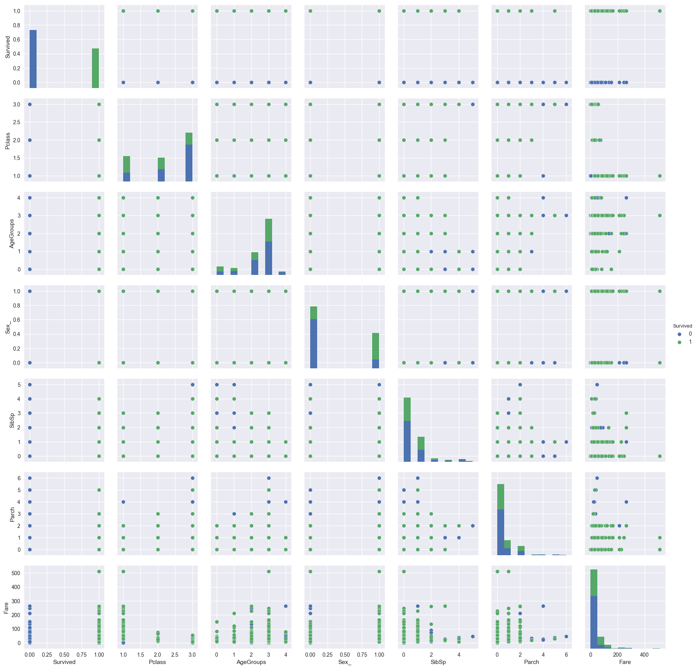


# Investigating the Data

## Getting Functions Ready


```python
%matplotlib inline
def add_pie_to_ax(values,labels,title,ax):
    limit = 0.9
    total = values.sum()
    values_, labels_ = zip(*sorted(zip(values, labels), reverse=True))
    sum_ = 0
    v_ = []
    l_ = []
    for ind in range(len(values_)):
        sum_ += values_[ind]
        v_.append(values_[ind])
        l_.append(labels_[ind])
        if (sum_*1.0/total)>limit and ind>=4:
            break
    if sum_<total:
        others = total-sum_
        v_.append(others)
        l_.append("Others")
    ax.pie(v_, labels=l_,
            autopct='%1.1f%%', shadow=True, startangle=90)
    ax.set_title(title)
```


```python
def plot_variable(dt,variable,ticks):
    fig = plt.figure(figsize=(15, 5), dpi= 180, facecolor='w', edgecolor='k')
    gs = gridspec.GridSpec(1, 20)
    dt_ = data.groupby(variable).mean()["Survived"]
    if ticks == None:
        ticks = dt_.index.values
    ax1 = fig.add_subplot(gs[0,0:7])
    values_, labels_ = zip(*sorted(zip(dt.groupby(variable)[variable].count().values, ticks), reverse=True))
    add_pie_to_ax(np.array(values_),np.array(labels_),"Distribution by "+variable,ax1)
    y_pos = np.arange(len(ticks))
    ax2 = fig.add_subplot(gs[0,9:20])
    ax2.bar(y_pos,dt_.values)
    ax2.set_ylabel("Survival Rate")
    ax2.set_title(variable)
    plt.xticks(y_pos, ticks)
```


```python
def correlation(data, key1, key2):
    
    std_x = data[key1].std(ddof=0)
    std_y = data[key2].std(ddof=0)
    normal_x = (data[key1] - data[key1].mean())/std_x
    normal_y = (data[key2] - data[key2].mean())/std_y
    return (normal_x * normal_y).mean()
```


```python
def correlation_by_values(x,y):
    
    std_x = x.std(ddof=0)
    std_y = y.std(ddof=0)
    normal_x = (x - x.mean())/std_x
    normal_y = (y - y.mean())/std_y
    return (normal_x * normal_y).mean()
```


```python
def add_bar_chart_for_comparison(dt, dt_survived, dt_not_survived, variable, ticks, x_ticks, ax):
    ax.set_ylabel('Number of Passengers')
    ax.set_xlabel(variable)
    corr = correlation_by_values(dt["Survived"],dt[variable])
    ax.set_title('Passengers grouped by '+variable+" (Correlation:"+str(corr)+")")
    ax.bar(x_ticks, dt_survived.values,width=0.4,color='g',align='center',label="Survived")
    ax.bar(x_ticks+0.4, dt_not_survived.values,width=0.4,color='r',align='center',label="Didn't Survive")
    plt.xticks(x_ticks+0.2, ticks)
    legend = plt.legend(loc='upper right', shadow=True).get_frame().set_facecolor('#AAAAAA');
    
def add_histogram_for_comparison(dt, variable, ax):
    series = dt[variable]
    # remove outliers
    dt_ = dt[np.abs(series-series.mean())<=(3*series.std())]
    mn = dt_[variable].min()
    mx = dt_[variable].max()
    bin_size = np.min([100.0, len(dt_.groupby(variable)[variable].count().values)*1.0])
    bin_width = (mx-mn)/bin_size
    bins = np.arange(start=mn-bin_width, stop=mx+2*bin_width, step=bin_width)
    sns.distplot(dt_.loc[(dt_['Survived']==0) & (~dt_[variable].isnull()),variable], bins=bins, color="r")
    sns.distplot(dt_.loc[(dt_['Survived']==1) & (~dt_[variable].isnull()),variable], bins=bins, color="g")
    plt.title(variable+' distribution among survival classes (3*sigma)')
    plt.ylabel('frequency')
    plt.legend(['did not survive', 'survived'], shadow=True).get_frame().set_alpha(0.8)#.set_facecolor('#AAAAAA');
    
def compare_survivals(dt,variable,ticks,is_categorical):
    dt_ = dt.groupby(variable)[variable].count()
    if ticks == None:
        ticks = dt_.index.values
    dt_survived = dt[dt['Survived'] == 1].groupby(variable)[variable].count().add(dt_*0, fill_value=0)
    dt_not_survived = dt[dt['Survived'] == 0].groupby(variable)[variable].count().add(dt_*0, fill_value=0)
    
    fig = plt.figure(figsize=(15, 10), dpi= 180, facecolor='w', edgecolor='k')
    gs = gridspec.GridSpec(2, 20)
    
    x_ticks = np.array(range(len(dt_.index.values)))*1.0
    add_bar_chart_for_comparison(dt, dt_survived, dt_not_survived, variable, ticks, x_ticks, fig.add_subplot(gs[1,:]))
    
    if is_categorical:
        sns.barplot(data=dt, x=variable, y='Survived', estimator=np.mean, ax=fig.add_subplot(gs[0,11:20]));
        plt.title("survival")
        plt.ylabel('proportion of survival');
        plt.xticks(x_ticks, ticks)
        sns.countplot(x=variable, data=dt, ax=fig.add_subplot(gs[0,0:9]))
        plt.xticks(x_ticks, ticks)
        plt.title("total")
    else:
        add_histogram_for_comparison(dt,variable,fig.add_subplot(gs[0,0:20]))
    plt.show()
    
```

## Which groups of people have the highest rates of survival?

Here, we will check categorical variables to see if a particular category of passengers have a better chance of survival.

### Gender


```python
plot_variable(data,"Sex",None)
```


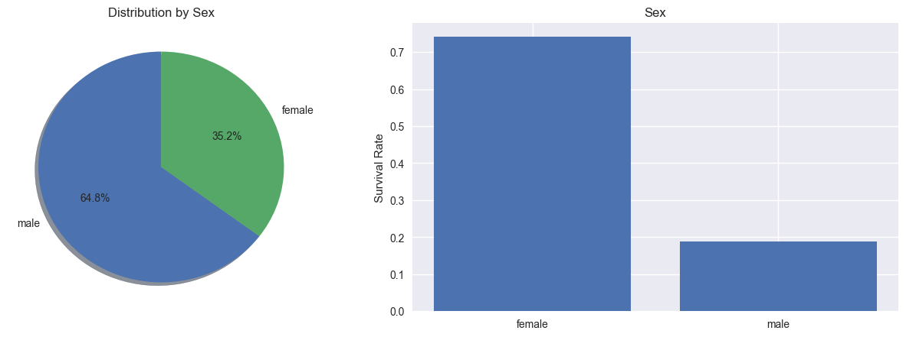


It seems ratio of female survivals is higher than onboarded females.

### Age


```python
plot_variable(data,"AgeGroups",age_groups)
```


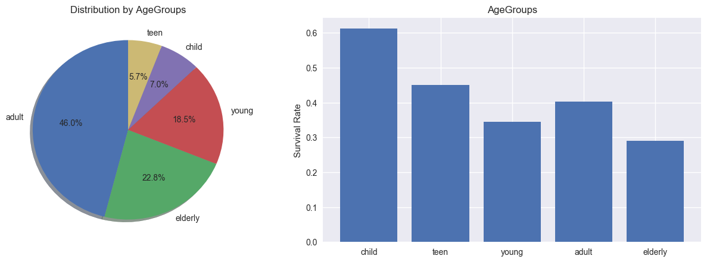


**Child** and **teen** age groups show a better survival ratios.

### Passenger Class


```python
plot_variable(data,"Pclass",classes)
```


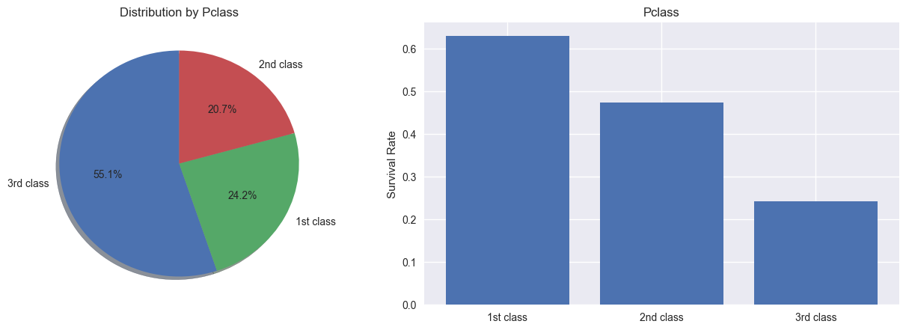


There is a significant difference between passenger classes. A 3rd class passenger is almost 3 times more likely to die than their peers in 1st class. 

### Embarking


```python
plot_variable(data,"Embarked",ports)
```


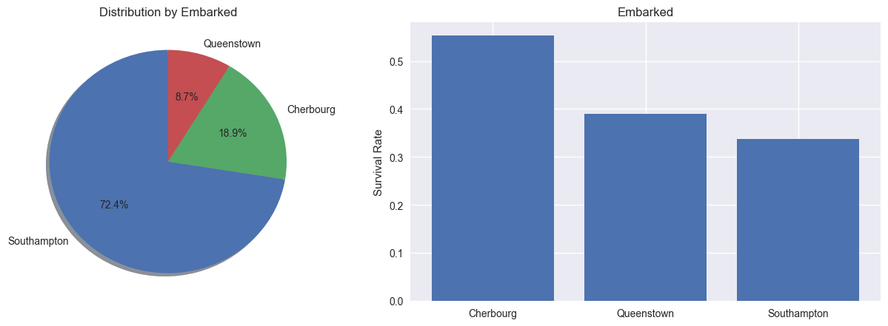


Passengers embarking on Cherbourg seem to be having a better chance survival. This is a strange result. This has something to do something with passengers embarking on different ports having different backgrounds.

### Result

**Females**, **child / teen** age groups, passengers in **1st class** and passengers ebarking on **Cherbourg** port seem to be enjoying an exceptionally higher chance of survival.

## What parameters have the highest influence on survival?


```python
keys = ["Survived","Pclass_","Age","Sex_","SibSp","Parch","Fare","Cabin_"]
correlations = np.zeros([len(keys)+1,len(keys)+1])
for idxx in range(len(keys)):
    for idxy in range(len(keys)):
        #Only calculate one triangle
        if idxx>idxy:
            correlations[idxx,idxy] = correlation(data_non_na,keys[idxx],keys[idxy])
for idxx in range(len(keys)):
    correlations[len(keys),idxx] = correlation(data,"AgeReported",keys[idxx])
keys.append("AgeReported")
correlations_df = pd.DataFrame(correlations, index=keys, columns=keys)
sns.heatmap(correlations_df,center=0, vmax=1, vmin=-1)
```


    <matplotlib.axes._subplots.AxesSubplot at 0x12683fd0>


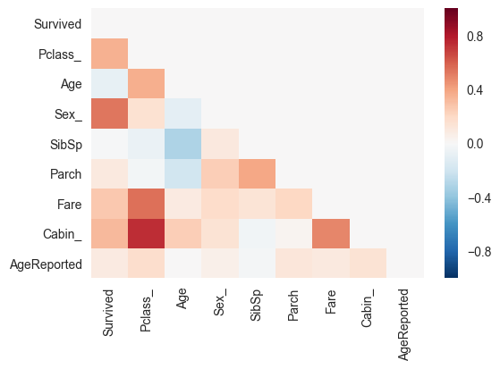


```python
correlations_df
```


<div>
<style>
    .dataframe thead tr:only-child th {
        text-align: right;
    }

    .dataframe thead th {
        text-align: left;
    }

    .dataframe tbody tr th {
        vertical-align: top;
    }
</style>
<table border="1" class="dataframe">
  <thead>
    <tr style="text-align: right;">
      <th></th>
      <th>Survived</th>
      <th>Pclass_</th>
      <th>Age</th>
      <th>Sex_</th>
      <th>SibSp</th>
      <th>Parch</th>
      <th>Fare</th>
      <th>Cabin_</th>
      <th>AgeReported</th>
    </tr>
  </thead>
  <tbody>
    <tr>
      <th>Survived</th>
      <td>0.000000</td>
      <td>0.000000</td>
      <td>0.000000e+00</td>
      <td>0.000000</td>
      <td>0.000000</td>
      <td>0.000000</td>
      <td>0.000000</td>
      <td>0.000000</td>
      <td>0.0</td>
    </tr>
    <tr>
      <th>Pclass_</th>
      <td>0.356462</td>
      <td>0.000000</td>
      <td>0.000000e+00</td>
      <td>0.000000</td>
      <td>0.000000</td>
      <td>0.000000</td>
      <td>0.000000</td>
      <td>0.000000</td>
      <td>0.0</td>
    </tr>
    <tr>
      <th>Age</th>
      <td>-0.082446</td>
      <td>0.365902</td>
      <td>0.000000e+00</td>
      <td>0.000000</td>
      <td>0.000000</td>
      <td>0.000000</td>
      <td>0.000000</td>
      <td>0.000000</td>
      <td>0.0</td>
    </tr>
    <tr>
      <th>Sex_</th>
      <td>0.536762</td>
      <td>0.150826</td>
      <td>-9.903723e-02</td>
      <td>0.000000</td>
      <td>0.000000</td>
      <td>0.000000</td>
      <td>0.000000</td>
      <td>0.000000</td>
      <td>0.0</td>
    </tr>
    <tr>
      <th>SibSp</th>
      <td>-0.015523</td>
      <td>-0.065187</td>
      <td>-3.073509e-01</td>
      <td>0.106296</td>
      <td>0.000000</td>
      <td>0.000000</td>
      <td>0.000000</td>
      <td>0.000000</td>
      <td>0.0</td>
    </tr>
    <tr>
      <th>Parch</th>
      <td>0.095265</td>
      <td>-0.023666</td>
      <td>-1.878965e-01</td>
      <td>0.249543</td>
      <td>0.383338</td>
      <td>0.000000</td>
      <td>0.000000</td>
      <td>0.000000</td>
      <td>0.0</td>
    </tr>
    <tr>
      <th>Fare</th>
      <td>0.266100</td>
      <td>0.552893</td>
      <td>9.314252e-02</td>
      <td>0.182457</td>
      <td>0.139860</td>
      <td>0.206624</td>
      <td>0.000000</td>
      <td>0.000000</td>
      <td>0.0</td>
    </tr>
    <tr>
      <th>Cabin_</th>
      <td>0.320733</td>
      <td>0.737721</td>
      <td>2.449808e-01</td>
      <td>0.143177</td>
      <td>-0.031345</td>
      <td>0.029509</td>
      <td>0.490477</td>
      <td>0.000000</td>
      <td>0.0</td>
    </tr>
    <tr>
      <th>AgeReported</th>
      <td>0.092197</td>
      <td>0.172933</td>
      <td>1.125967e-16</td>
      <td>0.055215</td>
      <td>-0.018958</td>
      <td>0.124104</td>
      <td>0.100707</td>
      <td>0.144111</td>
      <td>0.0</td>
    </tr>
  </tbody>
</table>
</div>


### Correlated Variables

**Cabin - Pclass:**

Having a cabin seems to be highly correlated with passenger class. Proving my point that I shouldn't be removing passengers with no cabin as NaN values. 

**Cabin - Survived:**


```python
compare_survivals(data_non_na,"Cabin_",["No Cabin","Has a Cabin"],True)
```


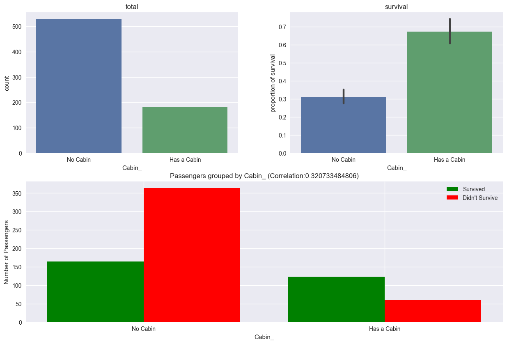


Having a cabin significantly improves chances of survival. However as we mentioned already in ***Checking for Problems in Data*** part, this variable is not to be trusted.

**Gender - Survived**: 


```python
compare_survivals(data_non_na,"Sex_",genders,True)
```


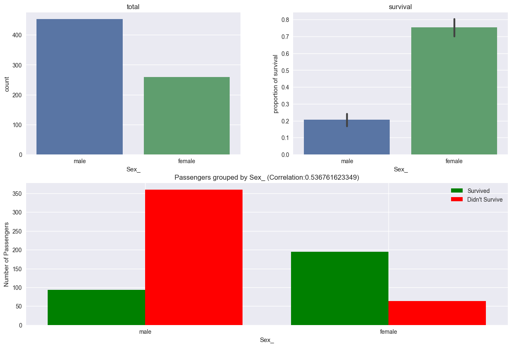


It seems survival rate is highly correlated with gender. Survival rate of female passengers is much higher than male passengers. On the other hand, gender is not strongly correlated with passenger class. However, gender seem to be negatively correlated with age. And age is negatively correlated with survival. Since females are younger, and young people tend to survive more, it is plausible that females survived with higher ratios.

**Fare - Survived**:


```python
compare_survivals(data_non_na,"Fare_",None,False)
```


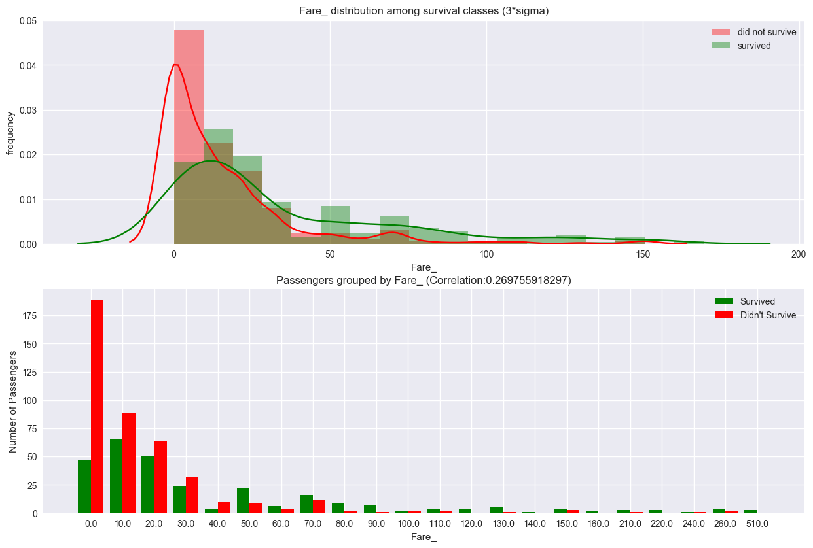


The highest casualty ratio belongs to the lowers fare group. As the Fares increases the chances of survival also increases. This relation means that the more money a passenger paid the more chance he/she survived.

**Pclass - Survived**:


```python
compare_survivals(data_non_na,"Pclass",classes,True)
```


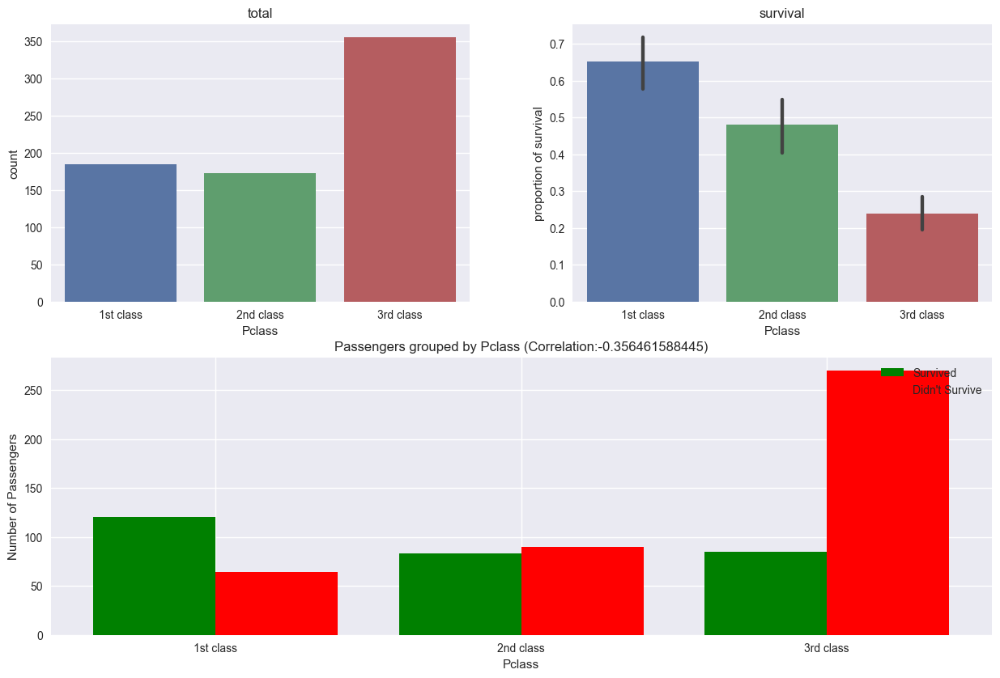


First class passengers have much lower casualty rates than third class. Even being in the second class greatly affects the chances of survival.

**SibSp - Survived**: 


```python
compare_survivals(data_non_na,"SibSp",None,False)
```


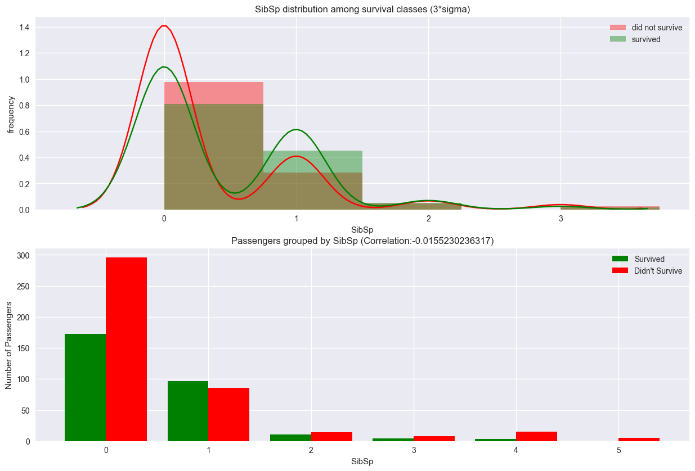


**SipSp** doesn't seem to be correlated with survival rate from correlation values. However, above graphs show that passengers having 1 siblings/brothers have a much better survival rate. 

**Age - Survived**:


```python
compare_survivals(data_non_na,"AgeGroups",age_groups,True)
```


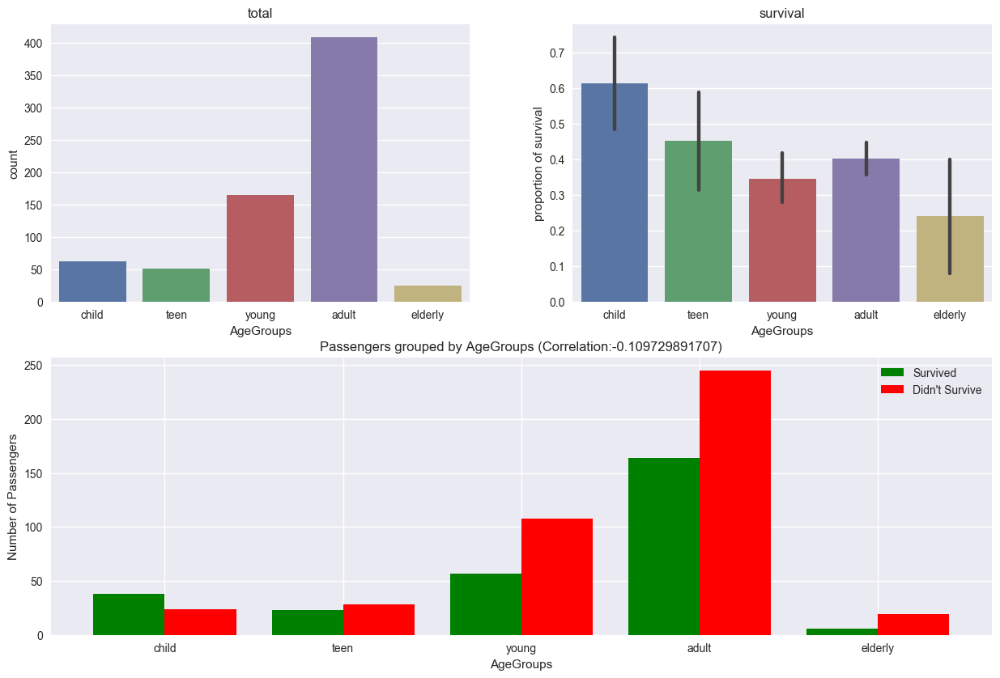


From age perspective, the only significant part is passengers between ages 0-15. They seem to be enjoying better survival rates. 

**Embarked - Survived**:

In first question part we found that Embarked port have an effect on survival ratio. We believed this is due to passengers background. Therfore we wanted to compare survival ratios with passenger classes.


```python
fig = plt.figure(figsize=(15, 5), dpi= 180, facecolor='w', edgecolor='k')
gs = gridspec.GridSpec(1, 20)
sns.barplot(data=data_non_na, x="Embarked", hue='Pclass', y='PassengerId', estimator=np.count_nonzero, ax=fig.add_subplot(gs[0,0:9]));
plt.ylabel('Number of Passengers');
sns.barplot(data=data_non_na, x="Embarked", hue='Pclass', y='Survived', estimator=np.mean, ax=fig.add_subplot(gs[0,11:20]));
plt.ylabel('Proportion of Survivors');
```


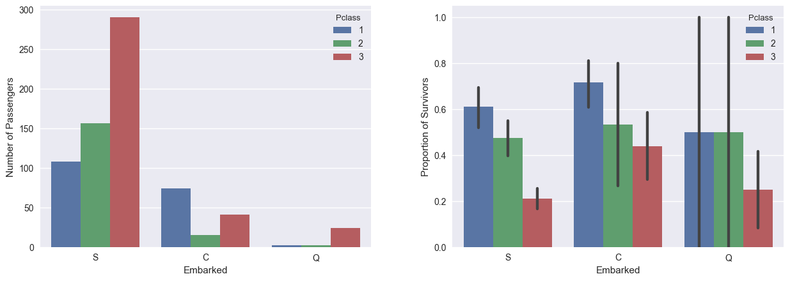


From above charts we can see that ratio of first class passengers is much higher in **Cherbourg**. This also explains why we have a higher survival ration within passengers embarking at **Cherbourg** port.

**Age - Survived (Only Females)**:

Since one of our best candidates for survival apart from being female is age, I want to investigate more into females and age groups. 


```python
compare_survivals(data_non_na[data_non_na["Sex_"]==1],"AgeGroups",age_groups,True)
```


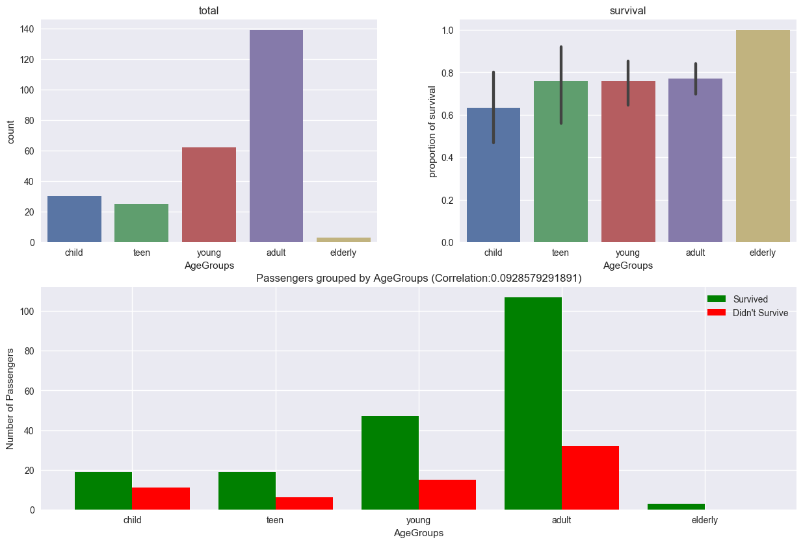


It seems that, even though female passengers enjoy higher survival ratios through all age groups, the older age groups have a slightly higher chance of survial.

**Passenger Class - Survived (Only Females)**:

The other candidate is passenger class, so Ialso wanted to investigate more females and passenger class. 


```python
compare_survivals(data_non_na[data_non_na["Sex"]=="female"],"Pclass",classes,True)
```


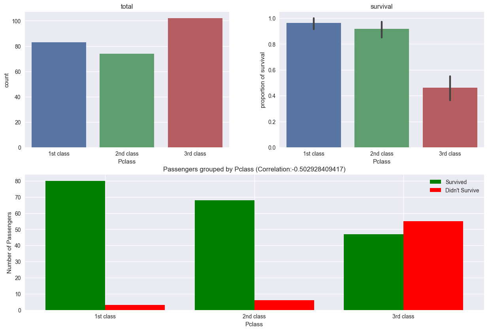


It seems females enjoy high survival rate not only in 1st class, but also in 2nd class.

### Result

The parameters that have the highest influence on survival are **Gender**, **Passenger Class**, and **Age** respectively. From another perspective Cabin have a higher influence though we decided to keep it out due to possible bias.

# Does the narrative in Titanic (1997) movie fit our expectations about Rose and Jack?

**Synopsis**

*Jack Dawson*(Leonardo DiCaprio) gets a **_3rd_** class ticket to the ship, and meets young *Rose DeWitt Bukater*(Kate Winslet) from **_1st_** class, where they fall in love. Upon the eventual down of the Titanic, however, Rose survives and Jack dies.

Assuming both Rose and Jack are in the *young* age group (18-24), we can predict their chances of survival as below.


```python
Rose = data[(data["Pclass"]==1) & (data["AgeGroups"]==2) & (data["Sex"]=="female")]
Rose.groupby("Survived").count()["PassengerId"]
```


    Survived
    1    19
    Name: PassengerId, dtype: int64


### All 19 Rose-like passengers aboard the ship actually survived!


```python
Jack = data[(data["Pclass"]==3) & (data["AgeGroups"]==2) & (data["Sex"]=="male")]
Jack.groupby("Survived").count()["PassengerId"]
```


    Survived
    0    67
    1     8
    Name: PassengerId, dtype: int64


### However, out of all 65 Jack-like passengers only 8 survived.

# Conclusions

There seems to be 891 passengers aboard. A quick check on Google shows that there are actually around [1316](https://en.wikipedia.org/wiki/Sinking_of_the_RMS_Titanic#Casualties_and_survivors) passengers. Therefore, this dataset has to be a subset of all passengers. In this case, we will not be able to present a full variables on population, but rather statistics about this subset. And due to the possibility that the subset is not randomly chosen, nor that info has a tendency being the most inbiased, most of our results will be open to discussion.

Cabin, Age, and Embarked columns have missing values. 

From various discussions over internet we can understand that many variables seem to be biased towards survivors. This is due to most of information being collected from survivors. This is especaillay the case with Cabin info.

Passenger class, gender, and having rented a cabin all greatly effects the chances of survival. First class, and female passengers have the highest survival ration.

Each port seem to be embarking passengers with different background. Cherbourg port is where most first class passengers are embarking.

Age reporting is slightly proportional with fares. Thus, it means ticket offices / officers payed little attention to report age of passengers with lower budgets. 
