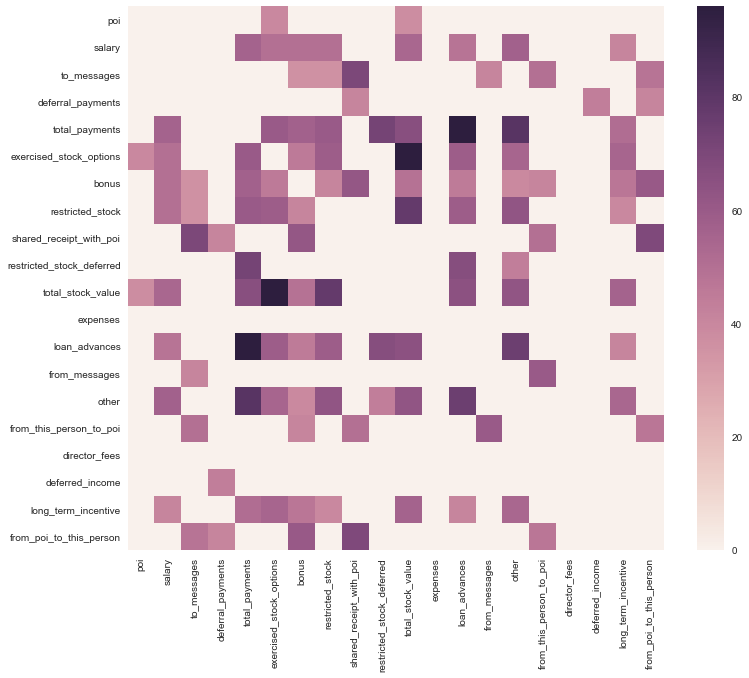

# Question 1
> Summarize for us the goal of this project and how machine learning is useful in trying to accomplish it. As part of your answer, give some background on the dataset and how it can be used to answer the project question. Were there any outliers in the data when you got it, and how did you handle those?  [relevant rubric items: “data exploration”, “outlier investigation”]

This project aims to build an efficient machine learning algorithm to programatically detect potential persons of interest within data. The model is expected to make the best use of available features withing Enron Dataset as well as creating new features to predict the poi from the available features. 

Enron data has 146 data points, 18 of which belong POIs. Each datapoint has 14 features. Features cover a wide variety of data from financial attributes like salary, bonuses, payments to email statistics like emails to POI, and emails from POI. Almost all features have missing values. We should also address this issue during this project.

Dataset has one outlier data which belongs to an entry named *TOTAL*. This entry clearly points to the subtotal for the entire dataset, and thereby should be discarded. Another entry named *LOCKHART EUGENE E* has no data point. Therefore we also di,scarded this. Discaridng these entries leaves 18 POI and 126 non-POI entries. With 12.5% POI within dataset, data is skewed towards non-POIs. We should keep an eye on this insight during score extractions from models. Assuming we are primarily concerned with detecting as many POIs as possible, recall will be the primary score we will be looking to.

# Question 2
> What features did you end up using in your POI identifier, and what selection process did you use to pick them? Did you have to do any scaling? Why or why not? As part of the assignment, you should attempt to engineer your own feature that does not come ready-made in the dataset -- explain what feature you tried to make, and the rationale behind it. (You do not necessarily have to use it in the final analysis, only engineer and test it.) In your feature selection step, if you used an algorithm like a decision tree, please also give the feature importances of the features that you use, and if you used an automated feature selection function like SelectKBest, please report the feature scores and reasons for your choice of parameter values.  [relevant rubric items: “create new features”, “intelligently select features”, “properly scale features”]

Since the number of variables was within acecptable range, I started with the full set to decide on an model parameters. Later on I was planning on reducing number of parameters. First approach was using Tree Classifier parameter weights extracted from trained classifier usign full variable set. 

#### Here is list of parameters with non-zero values (Weights before New Features):

Parameter|Weight
---|---
from_this_person_to_poi|0.247
expenses|0.16
deferral_payments|0.149
restricted_stock_deferred|0.094
restricted_stock|0.082
shared_receipt_with_poi|0.078
from_messages|0.075
other|0.055
deferred_income|0.055

I did not use any scaling, knowing scaling would have no effect on tree classifiers which I believed will be optimal predictors for this project. However, I filled missing values each with a **GaussianNB** predictor that used all parameters other than the original one plus the **poi** parameter. Later on the predictions from **GaussianNB** predictor are used to fill missing values.

I created two new variables, one for **ratio of mails received from POIs**, and the other for **ratio of mail sent to POIs**. I believe the numbers of mails sent to POI or received thereof would not give meaningful info. SOme might be sending too many emails or too few emails overall. In this case, having the ratio for their POI related emails would provide better insight.

#### Weights after New Features:
Parameter|Weight
---|---
to_poi_ratio|0.365
expenses|0.167
shared_receipt_with_poi|0.111
restricted_stock|0.11
restricted_stock_deferred|0.094
deferral_payments|0.093
other|0.055

#### Finalization or Feature Selection Based on Weights

In order to finalize the feature selection, I employed a gradual feature disposer which tests performance of each subset of features. The gradual feature disposer, showed increasing performance in Accuracy until the feature list is as below: 

    feature_list = [
        'to_poi_ratio',
        'from_poi_to_this_person',
        'shared_receipt_with_poi',
        'restricted_stock_deferred',
        'expenses',
        'deferral_payments',
        'from_poi_ratio',
        'salary',
        'to_messages',
        'total_payments',
        'exercised_stock_options',
        'bonus'
    ]

#### New Features and Their Contribution to the Classification:
**from_poi_ratio:** ratio of mails received from POIs

**to_poi_ratio:** ratio of mail sent to POIs

From first run with full feature list, I concluded that *from_poi_ratio* contributed to the classification better than any other variable with a weight of 0.28. However, *to_poi_ratio* seems to be contribution no meaningfull information. On the other hand, addition of these new features changed weights of other parameters. Most notably, *from_poi_to_this_person* is down to out of list from top position with 0.29.

#### Second Approach:

My second approach was finding features having correlation with poi higher than a certain limit, and other features that have a correlation higher than this certain limit with those that have this correlation with poi, and so forth until a depth value. I first used a depth of 1, since my initial correlation test showed that there are >0.9 correlations. However, after careful inspection, I found out, these high correlations were due to too many missing values. Therefore, I rerun the correlation routine after predicting missing values, which gave me sub 0.4 correlations. Finally I decided to use correlation limit of 0.35 with the depth value of 2. In addition to these features, I also included new features I created in the prior step.

Here is the full feature set I managed to get at the end of this process:

    feature_list = [
        'poi',
        'exercised_stock_options',
        'total_stock_value',
        'salary',
        'total_payments',
        'bonus',
        'restricted_stock',
        'loan_advances',
        'other',
        'long_term_incentive',
        'restricted_stock_deferred',
        'to_messages',
        'shared_receipt_with_poi',
        'from_this_person_to_poi',
        'from_poi_to_this_person'
    ]

#### Weights for Correlation Feature Selection:
Parameter|Weight
---|---
to_poi_ratio|0.278
total_stock_value|0.217
from_poi_to_this_person|0.146
total_payments|0.089
bonus|0.073
to_messages|0.068
shared_receipt_with_poi|0.064
restricted_stock|0.061

Seem like most of variables like *restricted_stock_deferred*, *loan_advances* did not effect the classification and contributed no meaningful info.

# Question 3
> What algorithm did you end up using? What other one(s) did you try? How did model performance differ between algorithms?  [relevant rubric item: “pick an algorithm”]

I decided to try all classifiers including linear models with an added rounding layer. From Linear models GaussianNB, and Linear Regression, the predictors are used without parameter tuning, since they dont have parameter tuning. For Lasso and other regular classifiers, I used a set of parameters with Grid Search. All scores listed below belong to best parameter combinations.

#### Trial-1: Full Feature Set Results:

Classifier|Accuracy|Precision|Recall|F1 Score|F2 Score
---|---|---|---|---|---
GaussianNB|0.886|0.333|0.249|0.285|0.263
Linear Regression|0.863|0.249|0.249|0.249|0.249
Lasso|0.863|0.249|0.249|0.249|0.249
SVC|0.909|0.0|0.0|0.0|0.0
DecisionTreeClassifier|0.863|0.249|0.249|0.249|0.249
RandomForestClassifier|0.931|0.999|0.249|0.399|0.294
__________
#### Trial-2: Full Feature Set Results + New Features:

Classifier|Accuracy|Precision|Recall|F1 Score|F2 Score
---|---|---|---|---|---
GaussianNB|0.886|0.333|0.249|0.285|0.263
Linear Regression|0.863|0.249|0.249|0.249|0.249
Lasso|0.863|0.249|0.249|0.249|0.249
SVC|0.909|0.0|0.0|0.0|0.0
DecisionTreeClassifier|0.863|0.374|0.749|0.499|0.624
RandomForestClassifier|0.931|0.666|0.499|0.571|0.526
______________
#### Trial-3: DecisionTreeClassifier Weights Feature Selector (Choosen Approach upon Results)

Classifier|Accuracy|Precision|Recall|F1 Score|F2 Score
---|---|---|---|---|---
GaussianNB|0.886|0.499|0.599|0.545|0.576
Linear Regression|0.909|0.666|0.399|0.499|0.434
Lasso|0.909|0.666|0.399|0.499|0.434
SVC|0.886|0.0|0.0|0.0|0.0
DecisionTreeClassifier|0.909|0.666|0.399|0.499|0.434
RandomForestClassifier|0.886|0.0|0.0|0.0|0.0

**Tester.py Scores for DecisionTreeClassifier:**

* Accuracy: 0.85967	
* Precision: 0.46436	
* Recall: 0.34200
_________________
#### Trial-4: Correlation (Depth = 2, Correlation Limit = 0.35) Results:

Classifier|Accuracy|Precision|Recall|F1 Score|F2 Score
---|---|---|---|---|---
GaussianNB|0.863|0.249|0.249|0.249|0.249
Linear Regression|0.863|0.249|0.249|0.249|0.249
Lasso|0.84|0.199|0.249|0.222|0.238
SVC|0.909|0.0|0.0|0.0|0.0
DecisionTreeClassifier|0.909|0.499|0.749|0.599|0.681
RandomForestClassifier|0.909|0.499|0.249|0.333|0.277

* Since this approach yielded no meaningful results upon earlier results, I decided not to do further tests with different Depths and Correlation limits. 

## Results for Classifier and Feature Set

* The best scores belong to **Trial-3: DecisionTreeClassifier Weights Feature Selector**; therefore, we decided to do our tests with feature set used for this trial. 

* **DecisionTreeClassifier w/ Weights Feature Selector** gave best results with highest Recall score of DecisionTreeClassifier (75%) and highest Precision of RandomForestClassifier (100%). 

* Since finding all POIs is more important than precisely finding correct POIs, the primary score is Recall. Therefore, I decided to go with **DecisionTreeClassifier**.

# Question 4
> What does it mean to tune the parameters of an algorithm, and what can happen if you don’t do this well?  How did you tune the parameters of your particular algorithm? What parameters did you tune? (Some algorithms do not have parameters that you need to tune -- if this is the case for the one you picked, identify and briefly explain how you would have done it for the model that was not your final choice or a different model that does utilize parameter tuning, e.g. a decision tree classifier).  [relevant rubric items: “discuss parameter tuning”, “tune the algorithm”]

Classifiers have a lot of parameters in order to decide their behaviors with fitting data and classifiying input. Each data will need different set of parameter values to classify input the most efficiently. Parameter tuning is trying to find this best parameters or getting close enough.

For this project I went through list of parameters available for tuning for each classifier. Each classifier is then wrapped with GridSearch alongside with this parameter ranges. Gridsearch, then tries all combinations of these parameter valu lists, and returns the best predictor configuration.

Parameters tuned for each model are as below:

#### Lasso

    parameters = {
        "alpha":[0.6,0.85,0.95,1.0],
        "fit_intercept":[True,False]
    }

#### SVM
    parameters = {
        "C":[0.1,1.0,10.0]
    }

#### DecisionTreeClassifier
    parameters = {
        "criterion":["gini","entropy"],
        "min_samples_leaf":[1,2,5],
        "min_samples_split":[2,4,10]
    }

#### RandomForestClassifier
    parameters = {
        "criterion":["gini","entropy"],
        "n_estimators":[5,10,30,100,200],
        "min_samples_leaf":[1,2,5],
        "min_samples_split":[2,4,10]
    }

At the end of parameter tuning I decided to go with **DecisionTreeClassifier**. The best parameters found with this classifier are as below:

    DecisionTreeClassifier(criterion='gini', min_samples_leaf=1, min_samples_split=2)

# Question 5
> What is validation, and what’s a classic mistake you can make if you do it wrong? How did you validate your analysis?  [relevant rubric items: “discuss validation”, “validation strategy”]

Validation is testing the classifier / model built for the purpose or classifying new data. To do this, original data should be split into two groups; namely, **train** and **test**. Splitting data in this way helps to evaluate the classifier with a dataset, the model never seen until this point. Thereby, we can make sure the evaluation does inded reflect unbiased results.

If we dont split dataset, the validation will be made with the same data the classifier is fitted/trained. In this case we will be asking classifier to classify data that it already know very well. This, will lean unrealistic scores. And even if classifier is overfit, we will no way of knowing.

Train data is used to build model/classifier. Test data is used to validate if the model behaves as expected. Test data is expected to be completely new to the classifier at the time testing. Test data can also be split into validation and test for bling testing. But in this project we only split data into train and test.

However, Enron Dataset has asymmetry in terms of POI / non-POI ratio. This may lead to shuffle splits leading to different rations of POI/non-POI in train and test subsets. In cases like this stratification can be used. K-fold cross-validation is a common approach used with stratification. Stratification is simply puts POIs and non-POIs into subsets with the ratio entire dataset has. However, in this project, we did not use stratification. Instead we used basic shuffle split.

However in model building stage of this project we only used shuffle split with train and test subsets. We first fitted out classifiers with train dataset. Later on we evaluated our classifiers based on test data. 

However this type of evaluation is not deterministic enough. To get results better evaluating classifier n-fold validation is used. In this method, data is reshuffled n times and tested with split results for each fold. Overall results are then combined. 

# Question 6
> Give at least 2 evaluation metrics and your average performance for each of them.  Explain an interpretation of your metrics that says something human-understandable about your algorithm’s performance. [relevant rubric item: “usage of evaluation metrics”]

**Accuracy:** The ratio of which prediction of POIs match the truth about employee

**Recall:** The ratio of POIs being identified.

**Precision:** The ratio of identified entries being POIs

My DecisionTreeClassifier achieved following scores for these metrics:

#### Using Train & Test Split: 

* Accuracy: **0.91**

* Recall: **0.5**

* Precision: **0.75**

While validating my classifiers I only user train-test split. However, tester script provided with the project evaluates the model with k-fold cross-validation. Evaluation results with this scripts are as follows:

#### Using Project Testing Script / tester.py (Cross-Validation: 1000):

* Accuracy: **0.86**	
* Precision: **0.46**	
* Recall: **0.36**

The difference between my results and CV results is mostly due to train-test split being in favor my results, which shows how cross validation can help better evaluate a classifier. 
